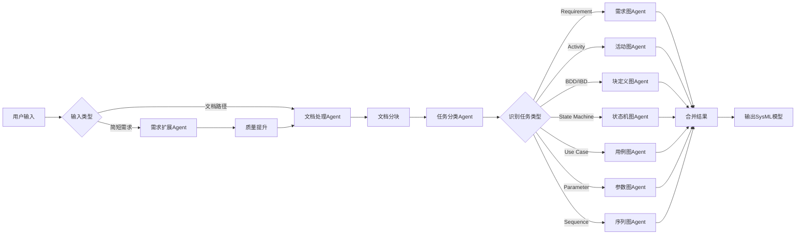

# LangGraph SysML自动建模系统

这是一个基于 LangGraph 和大语言模型的自动化 SysML 建模系统，能够将简短的需求描述或技术文档自动转换为完整的 SysML 模型。

## 🌟 功能特性

- ✅ **需求扩展**：将简短需求自动扩展为详细的系统设计文档
- ✅ **文档处理**：读取Word文档并智能分块
- ✅ **任务分类**：自动识别并分类SysML建模任务
- ✅ **多图表支持**：支持7种SysML图表类型
  - 需求图 (Requirement)
  - 块定义图和内部块图 (Block Definition and Internal Block)
  - 活动图 (Activity)
  - 状态机图 (State Machine)
  - 用例图 (Use Case)
  - 参数图 (Parameter)
  - 序列图 (Sequence)
- ✅ **流式输出**：实时查看LLM生成过程
- ✅ **质量提升**：两阶段处理确保文档质量
- ✅ **智能合并**：自动去重和整合相关内容

## 📁 项目结构

```
langgraph-项目/
├── src/
│   ├── agents/                      # Agent模块
│   │   ├── requirement_expander.py  # 需求扩展Agent
│   │   ├── document_processor.py    # 文档处理Agent
│   │   ├── task_classifier.py       # 任务分类Agent
│   │   └── diagram_agents/          # 各类SysML图表Agent
│   │       ├── req_agent.py         # 需求图Agent
│   │       ├── act_agent.py         # 活动图Agent
│   │       ├── bdd_ibd_agent.py     # BDD/IBD图Agent
│   │       ├── stm_agent.py         # 状态机图Agent
│   │       ├── uc_agent.py          # 用例图Agent
│   │       ├── par_agent.py         # 参数图Agent
│   │       └── sd_agent.py          # 序列图Agent
│   ├── graph/                       # 工作流模块
│   │   ├── workflow.py              # 工作流定义
│   │   └── workflow_state.py        # 工作流状态定义
│   ├── utils/                       # 工具模块
│   │   └── logs.py                  # 日志配置
│   └── main.py                      # 主程序入口
├── config/                          # 配置模块
│   ├── __init__.py
│   └── settings.py                  # 配置管理
├── data/                            # 数据目录
│   ├── examples/                    # 示例文档
│   └── output/                      # 输出目录
├── .env                             # 环境变量配置
├── .env.example                     # 环境变量示例
├── requirements.txt                 # 项目依赖
└── README.md                        # 项目说明
```

## 🚀 快速开始

### 1. 安装依赖

```bash
# 克隆项目
git clone <项目地址>
cd langgraph-项目

# 安装Python依赖
pip install -r requirements.txt
```

### 2. 配置环境变量

复制 `.env.example` 为 `.env` 并配置：

```bash
cp .env.example .env
```

编辑 `.env` 文件：

```env
# 智谱大模型配置
LLM_MODEL=glm-4
OPENAI_API_KEY=你的API密钥
BASE_URL=https://open.bigmodel.cn/api/paas/v4/

# 日志配置
LOG_LEVEL=INFO

# 工作流配置
SAVE_STAGES=true
ENABLE_QUALITY_ENHANCEMENT=true

# 文档处理配置
MAX_CHUNK_TOKENS=2000
CHUNK_OVERLAP_TOKENS=200

# 任务分类配置
TASK_EXTRACTION_ENHANCED=true
TASK_EXTRACTION_SIMILARITY_THRESHOLD=0.7
TASK_EXTRACTION_MIN_CONTENT_LENGTH=50
```

### 3. 运行程序

```bash
python -m src.main
```

## 💡 使用方法

程序启动后，会提示你选择输入方式：

```
================================================================================
欢迎使用需求扩展系统
================================================================================

请选择输入方式:
1. 输入简短需求描述
2. 读取Word文档
3. 同时使用（先扩展需求，再分块）

请选择 (1/2/3):
```

### 模式1：简短需求扩展

适合快速原型设计和需求探索：

```
请选择 (1/2/3): 1

请输入您的简短需求描述: 设计一个智能家居控制系统
```

系统会：
1. 🔄 将简短需求扩展为详细设计文档（流式输出）
2. 🔄 可选：进行质量提升（流式输出）
3. 📄 将文档分割为合适大小的chunks
4. 🔍 对每个chunk进行SysML任务分类
5. ⚙️ 调用对应的SysML Agent生成模型
6. 💾 保存所有中间结果和最终模型

### 模式2：文档导入

适合已有详细文档的项目：

```
请选择 (1/2/3): 2

请输入Word文档路径: ./docs/系统设计文档.docx
```

系统会：
1. 📖 读取Word文档内容
2. 📄 智能分块
3. 🔍 任务分类
4. ⚙️ 生成SysML模型

### 模式3：混合模式

先扩展需求，再结合文档：

```
请选择 (1/2/3): 3

请输入您的简短需求描述: 智能家居系统
请输入Word文档路径: ./docs/补充需求.docx
```

## 📊 工作流程



## 🎯 核心Agent说明

### 1. 需求扩展Agent (requirement_expander.py)

**功能**：将简短需求扩展为详细的系统设计文档

**输入**：
```python
state.input_short_req = "设计一个智能家居控制系统"
```

**输出**：
```python
state.expanded_content = """
# 需求规格
## 功能性需求
- 系统必须支持远程控制家电设备
- 支持场景模式自动化
...

# 系统结构
## 主要组件
1. 控制中心
2. 传感器网络
...
"""
```

**特点**：
- ✅ 两阶段处理（初始扩展 + 质量提升）
- ✅ 流式输出，实时查看生成过程
- ✅ 自动保存中间结果
- ✅ 覆盖SysML所需的7个方面

### 2. 文档处理Agent (document_processor.py)

**功能**：读取Word文档并智能分块

**输入**：
```python
state.input_doc_path = "./docs/系统设计.docx"
# 或
state.expanded_content = "长文本内容..."
```

**输出**：
```python
state.text_chunks = [
    "chunk 1: 需求相关内容...",
    "chunk 2: 架构相关内容...",
    "chunk 3: 流程相关内容..."
]
state.chunk_token_counts = [1800, 1950, 1600]
```

**特点**：
- ✅ 支持Word文档读取（保留标题层次）
- ✅ 基于token数量的智能分块
- ✅ 自动计算chunk重叠，保持上下文连贯
- ✅ 详细的分块统计信息

### 3. 任务分类Agent (task_classifier.py)

**功能**：识别并分类SysML建模任务

**输入**：
```python
state.text_chunks = ["chunk1...", "chunk2...", "chunk3..."]
```

**处理过程**：

1. **逐chunk分类**：
   ```python
   Chunk 1 → LLM → [
       {"type": "Requirement", "content": "功能需求..."},
       {"type": "Use Case", "content": "用户登录..."}
   ]
   
   Chunk 2 → LLM → [
       {"type": "Block Definition and Internal Block", "content": "系统组件..."},
       {"type": "Sequence", "content": "交互序列..."}
   ]
   ```

2. **按类型合并**：
   ```python
   合并后 = [
       {"type": "Requirement", "content": "Chunk1的需求 + Chunk3的需求"},
       {"type": "Use Case", "content": "Chunk1的用例 + Chunk2的用例"},
       {"type": "Block Definition and Internal Block", "content": "Chunk2的块定义"},
       {"type": "Sequence", "content": "Chunk2的序列"}
   ]
   ```

**输出**：
```python
state.assigned_tasks = [
    SysMLTask(
        id="TASK-a1b2c3d4",
        type="Requirement",
        content="合并后的所有需求内容",
        status=ProcessStatus.COMPLETED,
        result={...}  # 需求图Agent的生成结果
    ),
    SysMLTask(
        id="TASK-e5f6g7h8",
        type="Block Definition and Internal Block",
        content="合并后的所有块定义内容",
        status=ProcessStatus.COMPLETED,
        result={...}  # BDD/IBD Agent的生成结果
    ),
    ...
]
```

**特点**：
- ✅ 并行处理多个chunks，提高效率
- ✅ 智能去重和内容合并
- ✅ 自动调用对应的SysML Agent
- ✅ 详细的处理日志和统计信息

## 📋 输出文件

系统会在 `data/output/` 目录下生成以下文件：

```
data/output/
├── 初始扩展文档_20231103_143025.md       # 第一阶段扩展结果
├── 质量提升文档_20231103_143128.md       # 第二阶段优化结果
├── detailed_task_results_20231103_143230.json  # 详细任务结果
└── sysml_models/                         # SysML模型文件
    ├── requirement_model.json
    ├── activity_model.json
    ├── block_model.json
    └── ...
```

## 🔧 配置说明

### LLM配置

```env
LLM_MODEL=glm-4                    # 模型名称
OPENAI_API_KEY=your_key_here       # API密钥
BASE_URL=https://...               # API地址
```

支持的模型：
- 智谱GLM-4 (推荐)
- OpenAI GPT-4
- 其他兼容OpenAI API的模型

### 工作流配置

```env
SAVE_STAGES=true                   # 是否保存中间阶段文档
ENABLE_QUALITY_ENHANCEMENT=true    # 是否启用质量提升
```

### 文档处理配置

```env
MAX_CHUNK_TOKENS=2000             # 每个chunk的最大token数
CHUNK_OVERLAP_TOKENS=200          # chunk之间的重叠token数
```

建议值：
- 小文档：1000-1500 tokens
- 中等文档：2000-3000 tokens
- 大文档：3000-4000 tokens

### 任务分类配置

```env
TASK_EXTRACTION_ENHANCED=true            # 启用增强模式
TASK_EXTRACTION_SIMILARITY_THRESHOLD=0.7 # 相似度阈值
TASK_EXTRACTION_MIN_CONTENT_LENGTH=50    # 最小内容长度
```

## 📝 示例

### 示例1：智能家居系统

**输入**：
```
设计一个智能家居控制系统，支持灯光、空调、窗帘的远程控制
```

**生成的任务**：
- ✅ Requirement: 5个功能需求，3个非功能需求
- ✅ Block Definition: 控制中心、设备管理器、通信模块等8个块
- ✅ Activity: 设备控制流程、场景切换流程
- ✅ State Machine: 设备状态机（待机、运行、故障）
- ✅ Use Case: 用户远程控制、定时任务设置
- ✅ Sequence: 控制命令交互序列

### 示例2：文档导入

**输入文档**：`智能交通系统设计文档.docx`（约5000字）

**处理结果**：
- 📄 分割为3个chunks
- 🔍 识别出6种类型的任务
- ⚙️ 生成42个SysML元素
- ⏱️ 处理时间：约2分钟

## 🐛 常见问题

### Q1: API调用失败

**问题**：`Error: API key is invalid`

**解决**：
1. 检查 `.env` 文件中的 `OPENAI_API_KEY` 是否正确
2. 确认API密钥有足够的余额
3. 检查 `BASE_URL` 是否正确

### Q2: 文档分块过大或过小

**解决**：调整 `MAX_CHUNK_TOKENS` 配置
```env
MAX_CHUNK_TOKENS=3000  # 增加chunk大小
```

### Q3: 任务分类不准确

**解决**：
1. 启用质量提升模式
2. 调整相似度阈值
3. 提供更详细的输入描述

### Q4: 流式输出中断

**解决**：
1. 检查网络连接
2. 增加超时时间
3. 检查LLM服务状态

## 🔄 版本历史

### v1.0.0 (2024-11-03)
- ✅ 初始版本发布
- ✅ 支持7种SysML图表类型
- ✅ 实现三种输入模式
- ✅ 流式输出支持
- ✅ 智能文档分块
- ✅ 任务自动分类

## 📄 许可证

MIT License

## 🤝 贡献

欢迎提交Issue和Pull Request！

## 📧 联系方式

如有问题，请联系：[your-email@example.com]

---

**注意**：本项目使用大语言模型生成SysML模型，生成结果仅供参考，实际使用时请进行人工审核。
G:\My_Project\python\新建文件夹 (3)\langgraph-project\src\data\output\质量提升文档_20251103_020133.md