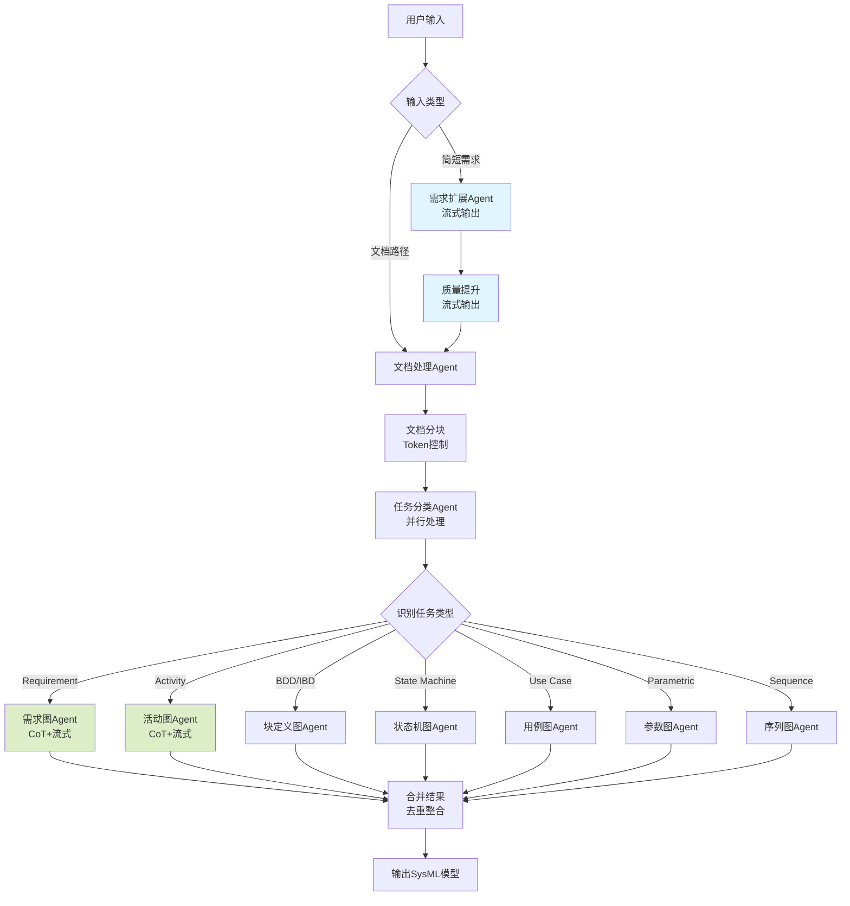

# LangGraph SysML自动建模系统

这是一个基于 LangGraph 和大语言模型的自动化 SysML 建模系统，能够将简短的需求描述或技术文档自动转换为完整的 SysML 模型。

## 🌟 功能特性

- ✅ **需求扩展**：将简短需求自动扩展为详细的系统设计文档（支持流式输出）
- ✅ **文档处理**：读取Word文档并智能分块
- ✅ **任务分类**：自动识别并分类SysML建模任务
- ✅ **多图表支持**：支持7种SysML图表类型
  - 需求图 (Requirement) - **已实现**
  - 活动图 (Activity) - **已实现**
  - 块定义图和内部块图 (Block Definition and Internal Block)
  - 状态机图 (State Machine)
  - 用例图 (Use Case)
  - 参数图 (Parametric)
  - 序列图 (Sequence)
- ✅ **流式输出**：实时查看LLM生成过程，包括推理和JSON生成两个阶段
- ✅ **质量提升**：两阶段处理确保文档质量（可配置开关）
- ✅ **智能合并**：自动去重和整合相关内容
- ✅ **CoT推理**：Chain-of-Thought推理过程可视化

## 📁 项目结构

## 📁 项目结构

```
langgraph-project/
├── src/
│   ├── main.py                      # 主程序入口
│   ├── agents/                      # Agent模块
│   │   ├── requirement_expander.py  # 需求扩展Agent（流式输出）
│   │   ├── document_processor.py    # 文档处理Agent
│   │   ├── task_classifier.py       # 任务分类Agent
│   │   └── diagram_agents/          # 各类SysML图表Agent
│   │       ├── req_agent.py         # 需求图Agent（CoT+流式）
│   │       └── act_agent.py         # 活动图Agent（CoT+流式）
│   ├── graph/                       # 工作流模块
│   │   ├── workflow.py              # 工作流定义
│   │   └── workflow_state.py        # 工作流状态定义
│   ├── config/                      # 配置模块
│   │   └── settings.py              # 配置管理
│   └── utils/                       # 工具模块
│       └── logs.py                  # 日志配置
├── data/                            # 数据目录
│   ├── examples/                    # 示例文档
│   └── output/                      # 输出目录
│       ├── requirement_diagrams/    # 需求图输出
│       └── activity_diagrams/       # 活动图输出
├── .env                             # 环境变量配置
├── .env.example                     # 环境变量示例
├── requirements.txt                 # 项目依赖
└── README.md                        # 项目说明
```

## 🚀 快速开始

### 1. 安装依赖

```bash
# 克隆项目
git clone <项目地址>
cd langgraph-project

# 安装Python依赖
pip install -r requirements.txt
```

### 2. 配置环境变量

复制 `.env.example` 为 `.env` 并配置：

```bash
cp .env.example .env
```

编辑 `.env` 文件：

```env
# 智谱大模型配置
LLM_MODEL=glm-4
OPENAI_API_KEY=你的API密钥
BASE_URL=https://open.bigmodel.cn/api/paas/v4/

# 日志配置
LOG_LEVEL=INFO

# 工作流配置
SAVE_STAGES=true                        # 是否保存中间阶段文档
ENABLE_QUALITY_ENHANCEMENT=true         # 是否启用质量提升

# 文档处理配置
MAX_CHUNK_TOKENS=2000                   # 每个chunk的最大token数
CHUNK_OVERLAP_TOKENS=200                # chunk之间的重叠token数

# 任务分类配置
TASK_EXTRACTION_ENHANCED=true           # 启用增强模式
TASK_EXTRACTION_SIMILARITY_THRESHOLD=0.7 # 相似度阈值
TASK_EXTRACTION_MIN_CONTENT_LENGTH=50   # 最小内容长度
```

### 3. 运行程序

```bash
cd src
python main.py
```

## 💡 使用方法

程序启动后，会提示你选择输入方式：

```
================================================================================
欢迎使用 SysML 自动建模系统
================================================================================

请选择输入方式:
1. 输入简短需求描述（AI自动扩展为详细文档）
2. 读取已有文档（Word/Markdown/文本文件）
3. 混合模式（先扩展需求，再读取补充文档）

请选择 (1/2/3):
```

### 模式1：简短需求扩展（推荐）

适合快速原型设计和需求探索：

```
请选择 (1/2/3): 1

请输入您的简短需求描述: 设计一个智能家居控制系统
```

系统会实时展示：
1. 🔄 **初始扩展阶段**（流式输出）
   - 实时显示需求扩展过程
   - 生成7个方面的详细设计文档
   
2. 🔄 **质量提升阶段**（流式输出，可选）
   - 实时显示质量优化过程
   - 增强技术深度和一致性

3. 📄 **文档分块**
   - 自动将长文档分割为合适大小
   - 保持上下文连贯性

4. 🔍 **任务分类**
   - 识别SysML图表类型
   - 合并相同类型任务

5. 🧠 **需求图生成**（两阶段流式）
   - **阶段1：CoT推理**（流式显示）
     - 识别模型和包
     - 识别需求、模块、测试用例
     - 识别派生、满足、验证关系
     - 提取详细的description信息
   
   - **阶段2：JSON生成**（流式显示）
     - 生成结构化JSON
     - 自动验证和修复
     - 补充缺失的description字段

6. 💾 **保存结果**
   - 保存中间结果（可选）
   - 保存最终SysML模型JSON

### 模式2：文档导入

适合已有详细文档的项目：

```
请选择 (1/2/3): 2

请输入文档路径（支持 .docx/.md/.txt）: ./docs/系统设计文档.docx
```

系统会：
1. 📖 读取Word文档内容
2. 📄 智能分块（保留标题层次）
3. 🔍 任务分类
4. ⚙️ 生成SysML模型（流式输出）

### 模式3：混合模式

结合需求扩展和文档导入：

```
请选择 (1/2/3): 3

请输入您的简短需求描述: 智能家居系统
请输入补充文档路径（可选，直接回车跳过）: ./docs/补充需求.docx
```

## 📊 工作流程




## 🎯 核心Agent详解

### 1. 需求扩展Agent (`requirement_expander.py`)

**功能**：将简短需求扩展为详细的系统设计文档

**输入**：
```python
state.input_short_req = "设计一个智能家居控制系统"
```

**两阶段流式处理**：

#### 阶段1：初始扩展（流式输出）
```python
initial_chain = initial_prompt | initial_llm | StrOutputParser()

initial_content = ""
for chunk in initial_chain.stream({"requirement": state.input_short_req}):
    print(chunk, end="", flush=True)  # 实时打印
    initial_content += chunk
```

实时生成包含7个方面的详细文档：
1. 需求规格 (Requirements)
2. 系统结构 (Block Definition and Internal Block)
3. 活动流程 (Activity)
4. 状态机行为 (State Machine)
5. 用例场景 (Use Case)
6. 参数关系 (Parametric)
7. 交互序列 (Sequence)

#### 阶段2：质量提升（流式输出，可选）
```python
enhance_chain = enhance_prompt | enhance_llm | StrOutputParser()

enhanced_content = ""
for chunk in enhance_chain.stream({"initial_content": initial_content}):
    print(chunk, end="", flush=True)  # 实时打印
    enhanced_content += chunk
```

**输出**：
```python
state.expanded_content = """
# 需求规格
## 功能性需求
- 系统必须支持远程控制家电设备
- 支持场景模式自动化
...

# 系统结构
## 主要组件
1. 控制中心
2. 传感器网络
...
"""
```

**特点**：
- ✅ 流式输出，实时查看生成过程
- ✅ 两阶段处理（可配置）
- ✅ 自动保存中间结果
- ✅ 覆盖SysML所需的7个方面

### 2. 文档处理Agent (`document_processor.py`)

**功能**：读取文档并智能分块

**输入**：
```python
# 方式1：文档路径
state.input_doc_path = "./docs/系统设计.docx"

# 方式2：扩展后的内容
state.expanded_content = "长文本内容..."
```

**输出**：
```python
state.text_chunks = [
    "chunk 1: 需求相关内容...",
    "chunk 2: 架构相关内容...",
    "chunk 3: 流程相关内容..."
]
state.chunk_token_counts = [1800, 1950, 1600]
```

**特点**：
- ✅ 支持Word文档（.docx）
- ✅ 基于token数量智能分块
- ✅ 保持上下文连贯（重叠区域）
- ✅ 详细的分块统计

### 3. 任务分类Agent (`task_classifier.py`)

**功能**：识别并分类SysML建模任务

**处理流程**：

#### 步骤1：逐chunk分类
```python
Chunk 1 → LLM → [
    {"type": "Requirement", "content": "功能需求..."},
    {"type": "Use Case", "content": "用户登录..."}
]

Chunk 2 → LLM → [
    {"type": "Block Definition and Internal Block", "content": "系统组件..."},
    {"type": "Sequence", "content": "交互序列..."}
]
```

#### 步骤2：按类型合并
```python
合并后 = [
    {"type": "Requirement", "content": "Chunk1需求 + Chunk3需求"},
    {"type": "Use Case", "content": "Chunk1用例 + Chunk2用例"},
    ...
]
```

#### 步骤3：调用对应Agent
每个任务类型调用相应的Agent处理

**输出**：
```python
state.assigned_tasks = [
    SysMLTask(
        id="TASK-a1b2c3d4",
        type="Requirement",
        content="合并后的所有需求内容",
        status=ProcessStatus.COMPLETED,
        result={...}
    ),
    ...
]
```

**特点**：
- ✅ 并行处理多个chunks
- ✅ 智能去重和合并
- ✅ 自动调用对应Agent
- ✅ 详细处理日志

### 4. 需求图Agent (`req_agent.py`)

**功能**：基于内容创建SysML需求图

**两阶段流式处理**：

#### 阶段1：CoT推理（流式输出）

展示8步推理过程：

```
================================================================================
🧠 阶段1: 需求分析与推理
================================================================================

#### 第一步：识别模型和包
- 模型名称: "项目Alpha需求模型" (model-alpha-req-uuid)
- 主要包: "核心功能" (pkg-corefunc-uuid)

#### 第二步：识别需求 (Requirements)
- 需求1:
    - ID: "R1"
    - 名称: "用户认证"
    - 文本: "系统必须提供用户注册和登录功能"
    - 描述: "原文：...。简化：该需求要求系统具备完整的用户身份认证能力..."

#### 第三步：识别系统模块 (Blocks)
...

#### 第四步：识别测试用例 (TestCases)
...

#### 第五步：识别派生关系 (DeriveReqt)
...

#### 第六步：识别满足关系 (Satisfy)
...

#### 第七步：识别验证关系 (Verify)
...

#### 第八步：整理优化输出
---
模型: 项目Alpha需求模型
  包: 核心功能
    需求:
      - R1: 用户认证
      - R1.1: 密码安全 (派生自R1)
    ...
---

================================================================================
✅ 推理完成
================================================================================
```

#### 阶段2：JSON生成（流式输出）

```
================================================================================
📝 阶段2: 生成结构化JSON
================================================================================

{
  "model": [
    {
      "id": "model-alpha-req-uuid",
      "name": "项目Alpha需求模型"
    }
  ],
  "elements": [
    {
      "id": "pkg-corefunc-uuid",
      "type": "Package",
      "name": "核心功能",
      "description": "包含系统核心的用户认证相关功能"
    },
    {
      "id": "req-userauth-uuid",
      "type": "Requirement",
      "name": "用户认证",
      "reqId": "R1",
      "text": "系统必须提供用户注册和登录功能",
      "parentId": "pkg-corefunc-uuid",
      "description": "原文：系统必须提供用户注册和登录功能。简化：该需求要求系统具备完整的用户身份认证能力..."
    },
    ...
  ]
}

================================================================================
✅ JSON生成完成
================================================================================
```

**生成的元素类型**：
- 📦 Package（包）
- 📋 Requirement（需求）
- 🔧 Block（系统模块）
- 🧪 TestCase（测试用例）
- 🔗 DeriveReqt（派生关系）
- ✅ Satisfy（满足关系）
- ✔️ Verify（验证关系）

**特点**：
- ✅ CoT推理过程可视化
- ✅ 流式输出两个阶段
- ✅ 自动验证和修复JSON
- ✅ 所有元素包含详细description
- ✅ 使用Pydantic模型验证

## 📋 输出文件

系统会在 `data/output/` 目录下生成以下文件：

```
data/output/
├── 初始扩展文档_20241103_143025.md              # 第一阶段扩展结果
├── 质量提升文档_20241103_143128.md              # 第二阶段优化结果（可选）
├── detailed_task_results_20241103_143230.json   # 详细任务结果
└── requirement_diagrams/                        # 需求图目录
    └── requirement_diagram_TASK-xxx_20241103_143330.json
```

### 需求图JSON结构

```json
{
  "model": [
    {
      "id": "model-unique-id",
      "name": "需求模型名称"
    }
  ],
  "elements": [
    {
      "id": "pkg-unique-id",
      "type": "Package",
      "name": "包名称",
      "description": "包的详细描述"
    },
    {
      "id": "req-unique-id",
      "type": "Requirement",
      "name": "需求名称",
      "reqId": "REQ-001",
      "text": "需求文本描述",
      "parentId": "pkg-unique-id",
      "description": "原文：[摘录]。简化：[总结]。背景：[可选]"
    },
    {
      "id": "blk-unique-id",
      "type": "Block",
      "name": "模块名称",
      "parentId": "pkg-unique-id",
      "description": "原文：[摘录]。职责：[描述]。组成：[可选]"
    },
    {
      "id": "tc-unique-id",
      "type": "TestCase",
      "name": "测试用例名称",
      "parentId": "pkg-unique-id",
      "description": "测试目的：...。测试方法：...。预期结果：..."
    },
    {
      "id": "rel-derive-unique-id",
      "type": "DeriveReqt",
      "sourceRequirementId": "req-general-id",
      "derivedRequirementId": "req-specific-id",
      "parentId": "pkg-unique-id",
      "description": "派生关系的详细说明"
    },
    {
      "id": "rel-satisfy-unique-id",
      "type": "Satisfy",
      "blockId": "blk-unique-id",
      "requirementId": "req-unique-id",
      "parentId": "pkg-unique-id",
      "description": "满足关系的详细说明"
    },
    {
      "id": "rel-verify-unique-id",
      "type": "Verify",
      "testCaseId": "tc-unique-id",
      "requirementId": "req-unique-id",
      "parentId": "pkg-unique-id",
      "description": "验证关系的详细说明"
    }
  ]
}
```

## 🔧 配置说明

### LLM配置

```env
LLM_MODEL=glm-4                    # 模型名称
OPENAI_API_KEY=your_key_here       # API密钥
BASE_URL=https://...               # API地址
```

**支持的模型**：
- ✅ 智谱GLM-4 (推荐)
- ✅ OpenAI GPT-4
- ✅ 其他兼容OpenAI API的模型

**流式输出配置**：
```python
llm = ChatOpenAI(
    model=settings.llm_model,
    streaming=True,  # 启用流式输出
    temperature=0.0  # 推理阶段使用低温度
)

# 使用stream方法
for chunk in chain.stream(input_data):
    print(chunk, end="", flush=True)
```

### 工作流配置

```env
SAVE_STAGES=true                   # 保存中间阶段文档
ENABLE_QUALITY_ENHANCEMENT=true    # 启用质量提升阶段
```

**配置效果**：
- `SAVE_STAGES=true`: 保存初始扩展文档和质量提升文档
- `ENABLE_QUALITY_ENHANCEMENT=false`: 跳过质量提升，直接使用初始扩展

### 文档处理配置

```env
MAX_CHUNK_TOKENS=2000             # 每个chunk的最大token数
CHUNK_OVERLAP_TOKENS=200          # chunk之间的重叠token数
```

**建议值**：
- 小文档（< 5000字）：1000-1500 tokens
- 中等文档（5000-20000字）：2000-3000 tokens
- 大文档（> 20000字）：3000-4000 tokens

### 任务分类配置

```env
TASK_EXTRACTION_ENHANCED=true            # 启用增强模式
TASK_EXTRACTION_SIMILARITY_THRESHOLD=0.7 # 相似度阈值
TASK_EXTRACTION_MIN_CONTENT_LENGTH=50    # 最小内容长度
```

## 📝 完整示例

### 示例1：智能家居系统（简短需求）

**输入**：
```
设计一个智能家居控制系统，支持灯光、空调、窗帘的远程控制
```

**执行过程**（实时流式显示）：

```
================================================================================
开始扩展用户需求
================================================================================

🔄 初始扩展文档生成中...
================================================================================

# 需求规格
## 功能性需求
- 系统必须支持远程控制家电设备（灯光、空调、窗帘）
- 支持场景模式自动化（如"回家模式"、"离家模式"）
...

================================================================================
✅ 初始扩展文档生成完成
================================================================================

🔄 质量提升文档生成中...
================================================================================

[质量提升后的详细文档...]

================================================================================
✅ 质量提升文档生成完成
================================================================================

================================================================================
🧠 阶段1: 需求分析与推理
================================================================================

#### 第一步：识别模型和包
- 模型名称: "智能家居控制系统需求模型"
...

================================================================================
✅ 推理完成
================================================================================

================================================================================
📝 阶段2: 生成结构化JSON
================================================================================

{
  "model": [...],
  "elements": [...]
}

================================================================================
✅ JSON生成完成
================================================================================

📊 需求图生成完成
================================================================================
文件路径: data/output/requirement_diagrams/requirement_diagram_TASK-xxx.json
模型数量: 1
元素总数: 28

元素类型统计:
  📋 Block: 6 个
  📋 DeriveReqt: 4 个
  📋 Package: 1 个
  📋 Requirement: 8 个
  📋 Satisfy: 6 个
  📋 TestCase: 1 个
  📋 Verify: 2 个
================================================================================
```

**生成的任务**：
- ✅ Requirement: 8个需求（功能+非功能）
- ✅ Block: 6个系统模块
- ✅ TestCase: 1个测试用例
- ✅ DeriveReqt: 4个派生关系
- ✅ Satisfy: 6个满足关系
- ✅ Verify: 2个验证关系

### 示例2：文档导入

**输入文档**：`智能交通系统设计文档.docx`（约5000字）

**处理结果**：
```
================================================================================
✅ 处理完成！
================================================================================
📝 扩展文档已保存到 data/output 目录
📄 文档已分割为 3 个chunks
🎯 识别并分配了 6 个SysML任务:
   ✅ Requirement: 2 个任务
   ✅ Block Definition and Internal Block: 1 个任务
   ✅ Activity: 1 个任务
   ✅ State Machine: 1 个任务
   ✅ Sequence: 1 个任务

📂 输出文件保存在: data/output/
================================================================================
```

**处理时间**：约2-3分钟

## 🐛 常见问题

### Q1: 流式输出卡住不动

**原因**：
- 网络连接问题
- API速率限制
- LLM服务异常

**解决方案**：
```python
# 1. 检查网络连接
ping open.bigmodel.cn

# 2. 增加超时时间
llm = ChatOpenAI(
    ...
    timeout=120,  # 增加超时时间
    max_retries=3  # 增加重试次数
)

# 3. 检查API配额
# 登录智谱AI控制台查看剩余额度
```

### Q2: JSON解析失败

**错误信息**：
```
❌ JSON验证失败，尝试修复: Expecting property name enclosed in double quotes
```

**解决方案**：
系统会自动尝试修复，如果失败：
1. 检查LLM输出是否包含markdown代码块
2. 使用`json_repair`库修复
3. 降低temperature参数

```python
# 已内置自动修复
from json_repair import repair_json

fixed_json = repair_json(json_str)
result = json.loads(fixed_json)
```

### Q3: Description字段缺失

**问题**：生成的JSON中部分元素缺少description

**解决方案**：
系统会自动补充默认描述：
```python
def validate_descriptions(result: Dict[str, Any]) -> Dict[str, Any]:
    """自动验证并补充description字段"""
    for elem in elements:
        if 'description' not in elem or not elem['description']:
            # 根据类型生成默认描述
            elem['description'] = f"{elem_type}元素的默认描述"
```

### Q4: 任务分类不准确

**问题**：识别的任务类型与实际内容不符

**解决方案**：
1. 启用质量提升模式（ENABLE_QUALITY_ENHANCEMENT=true）
2. 调整分块大小（MAX_CHUNK_TOKENS）
3. 提供更详细的输入描述
4. 检查输入文档的结构层次

```env
# 优化配置
MAX_CHUNK_TOKENS=3000                   # 增加chunk大小
ENABLE_QUALITY_ENHANCEMENT=true         # 启用质量提升
TASK_EXTRACTION_ENHANCED=true           # 启用增强提取
```

### Q5: API密钥无效

**错误信息**：
```
Error: API key is invalid
```

**解决步骤**：
1. 检查`.env`文件中的`OPENAI_API_KEY`
2. 确认API密钥格式正确
3. 检查API密钥权限和余额
4. 验证`BASE_URL`配置正确

```bash
# 测试API连接
curl -X POST "https://open.bigmodel.cn/api/paas/v4/chat/completions" \
  -H "Authorization: Bearer YOUR_API_KEY" \
  -H "Content-Type: application/json" \
  -d '{"model":"glm-4","messages":[{"role":"user","content":"Hi"}]}'
```

### Q6: 内存不足

**问题**：处理大文档时内存溢出

**解决方案**：
1. 减小chunk大小
2. 分批处理
3. 清理中间变量

```env
# 内存优化配置
MAX_CHUNK_TOKENS=1500      # 减小chunk
SAVE_STAGES=false          # 不保存中间结果
```

## 🔄 开发路线图

### 当前版本 (v1.0.0)
- ✅ 需求扩展Agent（流式输出）
- ✅ 文档处理Agent
- ✅ 任务分类Agent
- ✅ 需求图Agent（CoT推理+流式）
- ✅ 基础工作流

### 计划中 (v1.1.0)
- ⏳ 活动图Agent
- ⏳ 状态机图Agent
- ⏳ 用例图Agent
- ⏳ 块定义图/内部块图Agent

### 未来版本 (v2.0.0)
- ⏳ 参数图Agent
- ⏳ 序列图Agent
- ⏳ 图表关联分析
- ⏳ 模型一致性检查
- ⏳ 交互式修改界面

## 🛠️ 技术栈

- **框架**: LangChain, LangGraph
- **LLM**: 智谱GLM-4 / OpenAI GPT-4
- **数据验证**: Pydantic
- **JSON修复**: json-repair
- **文档处理**: python-docx
- **环境管理**: python-dotenv

## 📄 许可证

MIT License

## 🤝 贡献指南

欢迎提交Issue和Pull Request！

**贡献步骤**：
1. Fork项目
2. 创建特性分支 (`git checkout -b feature/AmazingFeature`)
3. 提交更改 (`git commit -m 'Add some AmazingFeature'`)
4. 推送到分支 (`git push origin feature/AmazingFeature`)
5. 开启Pull Request

**代码规范**：
- 遵循PEP 8
- 添加类型注解
- 编写文档字符串
- 添加单元测试

## 📧 联系方式

如有问题，请通过以下方式联系：
- 提交GitHub Issue
- 邮箱：your-email@example.com

## 🙏 致谢

感谢以下开源项目：
- [LangChain](https://github.com/langchain-ai/langchain)
- [LangGraph](https://github.com/langchain-ai/langgraph)
- [Pydantic](https://github.com/pydantic/pydantic)
- [智谱AI](https://open.bigmodel.cn/)

---

**注意**：
1. 本项目使用大语言模型生成SysML模型，生成结果仅供参考
2. 实际使用时请进行人工审核和调整
3. 建议在正式项目中进行充分测试
4. 流式输出需要稳定的网络连接
G:\My_Project\python\新建文件夹 (3)\langgraph-project\src\data\output\质量提升文档_20251103_151841.md