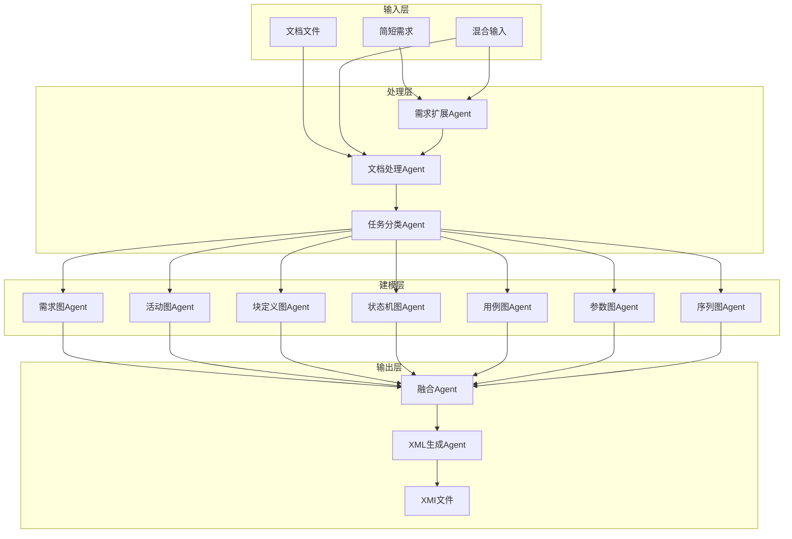
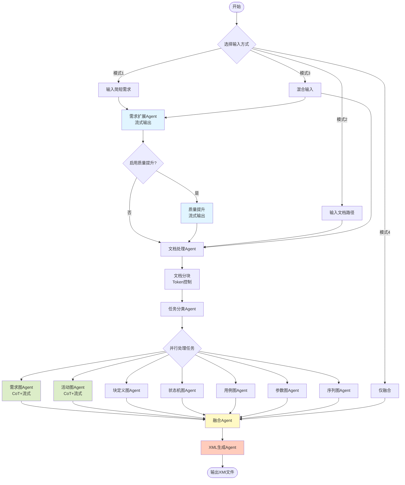
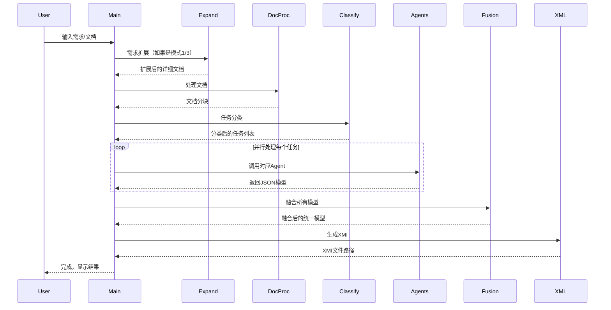
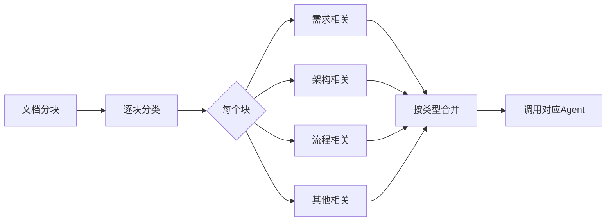
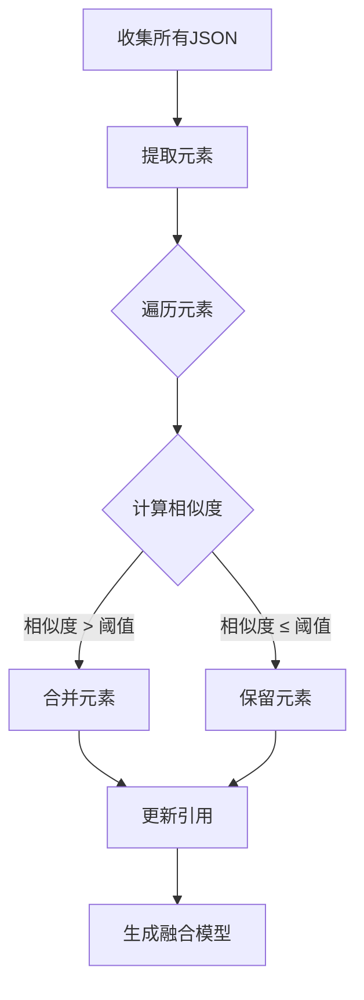

# LangGraph SysML自动建模系统

[](https://www.python.org/)
[](LICENSE)
[](https://github.com/langchain-ai/langchain)
[](https://github.com/yourusername/langgraph-project)

这是一个基于 LangGraph 和大语言模型的自动化 SysML 建模系统，能够将简短的需求描述或技术文档自动转换为完整的 SysML 模型，并最终生成符合 XMI 2.5 标准的 XML 文件。

## 📖 目录

- [功能特性](#-功能特性)
- [系统架构](#-系统架构)
- [项目结构](#-项目结构)
- [快速开始](#-快速开始)
- [使用指南](#-使用指南)
- [工作流程](#-工作流程)
- [核心Agent详解](#-核心agent详解)
- [输出文件说明](#-输出文件说明)
- [配置说明](#-配置说明)
- [完整示例](#-完整示例)
- [常见问题](#-常见问题)
- [开发路线图](#-开发路线图)
- [技术栈](#️-技术栈)
- [贡献指南](#-贡献指南)

## 🌟 功能特性

### 核心功能

- ✅ **需求扩展**：将简短需求自动扩展为详细的系统设计文档（支持流式输出）
- ✅ **文档处理**：读取Word/Markdown/文本文档并智能分块
- ✅ **任务分类**：自动识别并分类SysML建模任务
- ✅ **多图表支持**：支持7种SysML图表类型
- ✅ **模型融合**：自动合并和去重多个图表模型
- ✅ **XML生成**：生成符合XMI 2.5标准的XML文件

### 支持的SysML图表

| 图表类型                    | 状态     | 描述                       |
| --------------------------- | -------- | -------------------------- |
| 需求图 (Requirement)        | ✅ 已实现 | 需求、满足、验证、派生关系 |
| 活动图 (Activity)           | ✅ 已实现 | 活动节点、控制流、对象流   |
| 块定义图 (Block Definition) | ✅ 已实现 | 块、端口、属性、关联       |
| 内部块图 (Internal Block)   | ✅ 已实现 | 内部结构、连接器、绑定     |
| 状态机图 (State Machine)    | ✅ 已实现 | 状态、转换、伪状态         |
| 用例图 (Use Case)           | ✅ 已实现 | 用例、参与者、关系         |
| 参数图 (Parametric)         | ✅ 已实现 | 约束块、约束参数           |
| 序列图 (Sequence)           | ✅ 已实现 | 生命线、消息、交互         |

### 高级特性

- 🔄 **流式输出**：实时查看LLM生成过程，包括推理和JSON生成两个阶段
- 🧠 **CoT推理**：Chain-of-Thought推理过程可视化
- 📊 **质量提升**：两阶段处理确保文档质量（可配置开关）
- 🔗 **智能融合**：自动识别相似元素并合并
- 🎯 **精准分类**：基于语义相似度的任务分类
- 📝 **详细描述**：所有元素自动生成详细的description字段
- 💾 **中间保存**：可选择保存各阶段中间结果
- 🔍 **模型验证**：自动验证和修复JSON结构

## 🏗️ 系统架构



## 📁 项目结构

```
langgraph-project/
├── src/                                  # 源代码目录
│   ├── main.py                          # 主程序入口
│   ├── agents/                          # Agent模块
│   │   ├── requirement_expander.py      # 需求扩展Agent（流式输出）
│   │   ├── document_processor.py        # 文档处理Agent
│   │   ├── task_classifier.py           # 任务分类Agent
│   │   ├── fusion_agent.py              # 融合Agent
│   │   ├── xml_generator.py             # XML生成Agent
│   │   └── diagram_agents/              # 各类SysML图表Agent
│   │       ├── req_agent.py             # 需求图Agent（CoT+流式）
│   │       ├── act_agent.py             # 活动图Agent（CoT+流式）
│   │       ├── bdd_agent.py             # 块定义图Agent
│   │       ├── ibd_agent.py             # 内部块图Agent
│   │       ├── stm_agent.py             # 状态机图Agent
│   │       ├── uc_agent.py              # 用例图Agent
│   │       ├── par_agent.py             # 参数图Agent
│   │       └── seq_agent.py             # 序列图Agent
│   ├── graph/                           # 工作流模块
│   │   ├── workflow.py                  # 工作流定义
│   │   └── workflow_state.py            # 工作流状态定义
│   ├── xml_generator/                   # XML生成模块
│   │   └── unify_sysml_to_csm.py       # 统一XML生成器
│   ├── fusion/                          # 融合模块
│   │   └── model_fusion.py              # 模型融合逻辑
│   ├── config/                          # 配置模块
│   │   └── settings.py                  # 配置管理
│   └── utils/                           # 工具模块
│       ├── logs.py                      # 日志配置
│       └── helpers.py                   # 辅助函数
├── data/                                # 数据目录
│   ├── examples/                        # 示例文档
│   │   ├── example1.docx               # 示例Word文档
│   │   └── example2.md                 # 示例Markdown文档
│   └── output/                          # 输出目录
│       ├── requirement_diagrams/        # 需求图输出
│       ├── activity_diagrams/           # 活动图输出
│       ├── block_diagrams/              # 块定义图输出
│       ├── state_machine_diagrams/      # 状态机图输出
│       ├── usecase_diagrams/            # 用例图输出
│       ├── parametric_diagrams/         # 参数图输出
│       ├── sequence_diagrams/           # 序列图输出
│       ├── fused_model_*.json           # 融合后的模型
│       └── unified_model_*.xmi          # 生成的XMI文件
├── tests/                               # 测试目录
│   ├── test_agents.py                   # Agent测试
│   ├── test_workflow.py                 # 工作流测试
│   └── test_fusion.py                   # 融合测试
├── docs/                                # 文档目录
│   ├── API.md                          # API文档
│   ├── ARCHITECTURE.md                  # 架构文档
│   └── EXAMPLES.md                      # 示例文档
├── .env                                 # 环境变量配置
├── .env.example                         # 环境变量示例
├── .gitignore                           # Git忽略文件
├── requirements.txt                     # Python依赖
├── setup.py                             # 安装脚本
├── LICENSE                              # 许可证
└── README.md                            # 项目说明
```

## 🚀 快速开始

### 环境要求

- Python 3.8 或更高版本
- pip 或 conda 包管理器
- 稳定的网络连接（用于调用LLM API）
- 至少 4GB 可用内存

### 1. 克隆项目

```bash
git clone https://github.com/yourusername/langgraph-project.git
cd langgraph-project
```

### 2. 创建虚拟环境（推荐）

```bash
# 使用 venv
python -m venv venv

# Windows 激活
venv\Scripts\activate

# Linux/Mac 激活
source venv/bin/activate

# 或使用 conda
conda create -n langgraph python=3.8
conda activate langgraph
```

### 3. 安装依赖

```bash
pip install -r requirements.txt
```

**依赖包列表**：
```txt
langchain>=0.1.0
langgraph>=0.0.20
openai>=1.0.0
pydantic>=2.0.0
python-dotenv>=1.0.0
python-docx>=0.8.11
tiktoken>=0.5.0
json-repair>=0.7.0
numpy>=1.24.0
scikit-learn>=1.3.0
```

### 4. 配置环境变量

```bash
# 复制示例配置文件
cp .env.example .env

# 编辑 .env 文件
nano .env  # 或使用其他编辑器
```

**必需配置**：
```env
# ==================== LLM配置 ====================
LLM_MODEL=glm-4
OPENAI_API_KEY=your_api_key_here
BASE_URL=https://open.bigmodel.cn/api/paas/v4/

# ==================== 日志配置 ====================
LOG_LEVEL=INFO

# ==================== 工作流配置 ====================
SAVE_STAGES=true
ENABLE_QUALITY_ENHANCEMENT=true

# ==================== 文档处理配置 ====================
MAX_CHUNK_TOKENS=2000
CHUNK_OVERLAP_TOKENS=200

# ==================== 任务分类配置 ====================
TASK_EXTRACTION_ENHANCED=true
TASK_EXTRACTION_SIMILARITY_THRESHOLD=0.7
TASK_EXTRACTION_MIN_CONTENT_LENGTH=50

# ==================== 融合配置 ====================
FUSION_SIMILARITY_THRESHOLD=0.85
FUSION_ENABLE_AUTO_MERGE=true

# ==================== XML生成配置 ====================
XML_INCLUDE_METADATA=true
XML_PRETTY_PRINT=true
```

### 5. 运行程序

```bash
cd src
python main.py
```

### 6. 验证安装

```bash
# 运行测试
pytest tests/

# 检查版本
python -c "import langchain; print(langchain.__version__)"
```

## 💡 使用指南

### 启动界面

```
================================================================================
欢迎使用 SysML 自动建模系统
================================================================================

请选择输入方式:
1. 输入简短需求描述（AI自动扩展为详细文档）
2. 读取已有文档（Word/Markdown/文本文件）
3. 混合模式（先扩展需求，再读取补充文档）
4. 仅运行融合（使用已生成的JSON文件）

请选择 (1/2/3/4):
```

### 模式1：简短需求扩展（推荐）

**适用场景**：
- 快速原型设计
- 需求探索阶段
- 概念验证

**操作步骤**：
```
请选择 (1/2/3/4): 1

请输入您的简短需求描述: 设计一个智能家居控制系统
```

**执行流程**：

1. **需求扩展阶段**（流式输出）
   ```
   🔄 初始扩展文档生成中...
   ================================================================================
   
   # 需求规格
   ## 功能性需求
   - 系统必须支持远程控制家电设备...
   ```

2. **质量提升阶段**（可选，流式输出）
   ```
   🔄 质量提升文档生成中...
   ================================================================================
   
   [优化后的详细内容...]
   ```

3. **文档分块**
   ```
   📄 文档已分割为 3 个chunks
   ```

4. **任务分类与建模**
   ```
   🎯 识别并分配了 6 个SysML任务
   ```

5. **模型融合**
   ```
   🔗 融合状态: completed
   ✅ 融合输出: data/output/fused_model_20251111_143025.json
   ```

6. **XML生成**
   ```
   🔨 XML生成状态: completed
   ✅ XMI输出: data/output/unified_model_20251111_143125.xmi
   ```

### 模式2：文档导入

**适用场景**：
- 已有详细文档的项目
- 需要批量处理
- 正式项目开发

**操作步骤**：
```
请选择 (1/2/3/4): 2

请输入文档路径（支持 .docx/.md/.txt）: ./docs/系统设计文档.docx
```

**支持的文件格式**：
- `.docx` - Microsoft Word文档
- `.md` - Markdown文档
- `.txt` - 纯文本文件

**文档要求**：
- 明确的章节结构
- 包含需求、架构、流程等信息
- 建议使用标题层次组织内容

### 模式3：混合模式

**适用场景**：
- 需求不完整
- 需要AI辅助扩展
- 结合文档和创意

**操作步骤**：
```
请选择 (1/2/3/4): 3

请输入您的简短需求描述: 智能家居系统
请输入补充文档路径（可选，直接回车跳过）: ./docs/补充需求.docx
```

### 模式4：仅运行融合

**适用场景**：
- 已有多个JSON模型文件
- 需要重新融合
- 调试融合逻辑

**操作步骤**：
```
请选择 (1/2/3/4): 4

是否指定JSON目录？(y/n，默认n自动扫描data/output): n
```

**自动扫描目录**：
- `data/output/requirement_diagrams/`
- `data/output/activity_diagrams/`
- `data/output/block_diagrams/`
- 等所有图表类型目录

## 📊 工作流程

### 完整流程图



### 数据流转



## 🧠 核心Agent详解

### 1. 需求扩展Agent

**文件**：`agents/requirement_expander.py`

**功能**：将简短需求扩展为详细的系统设计文档

**输入输出**：
```python
# 输入
state.input_short_req = "设计一个智能家居控制系统"

# 输出
state.expanded_content = """
# 需求规格
## 功能性需求
...
"""
```

**两阶段处理**：

#### 阶段1：初始扩展（流式输出）

**Prompt模板**：
```python
initial_prompt = ChatPromptTemplate.from_template("""
你是一位经验丰富的系统工程师。请将用户的简短需求扩展为详细的系统设计文档。

用户需求：{requirement}

请按照以下7个方面进行扩展：
1. 需求规格 (Requirements)
2. 系统结构 (Block Definition and Internal Block)
3. 活动流程 (Activity)
4. 状态机行为 (State Machine)
5. 用例场景 (Use Case)
6. 参数关系 (Parametric)
7. 交互序列 (Sequence)

要求：
- 每个方面至少包含3个具体内容
- 使用清晰的Markdown格式
- 包含必要的技术细节
""")
```

**流式输出实现**：
```python
initial_chain = initial_prompt | initial_llm | StrOutputParser()

initial_content = ""
for chunk in initial_chain.stream({"requirement": state.input_short_req}):
    print(chunk, end="", flush=True)
    initial_content += chunk
```

#### 阶段2：质量提升（流式输出）

**Prompt模板**：
```python
enhance_prompt = ChatPromptTemplate.from_template("""
请对以下系统设计文档进行质量提升：

{initial_content}

优化方向：
1. 增强技术深度和专业性
2. 补充遗漏的细节
3. 确保各部分一致性
4. 优化表达和结构
""")
```

**配置开关**：
```env
ENABLE_QUALITY_ENHANCEMENT=true  # 启用质量提升
```

### 2. 文档处理Agent

**文件**：`agents/document_processor.py`

**功能**：读取文档并智能分块

**支持的输入源**：
1. Word文档（.docx）
2. Markdown文件（.md）
3. 文本文件（.txt）
4. 扩展后的内容（expanded_content）

**分块策略**：
```python
def chunk_by_tokens(text: str, max_tokens: int, overlap: int):
    """基于token数量智能分块"""
    # 1. 分割段落
    paragraphs = text.split('\n\n')
    
    # 2. 累积到达max_tokens
    current_chunk = []
    current_tokens = 0
    
    # 3. 添加overlap确保连贯性
    ...
```

**示例输出**：
```python
state.text_chunks = [
    "chunk 1 content...",  # 1800 tokens
    "chunk 2 content...",  # 1950 tokens
    "chunk 3 content..."   # 1600 tokens
]
state.chunk_token_counts = [1800, 1950, 1600]
```

### 3. 任务分类Agent

**文件**：`agents/task_classifier.py`

**功能**：识别并分类SysML建模任务

**处理流程**：



**分类Prompt**：
```python
classify_prompt = ChatPromptTemplate.from_template("""
分析以下文档内容，识别SysML建模任务：

{chunk_content}

请识别：
1. Requirement - 需求、约束、规格
2. Block Definition and Internal Block - 系统结构、组件
3. Activity - 活动流程、工作流
4. State Machine - 状态转换、行为
5. Use Case - 用例、场景
6. Parametric - 参数约束、公式
7. Sequence - 交互序列、消息传递

输出JSON格式：
{{
  "tasks": [
    {{"type": "Requirement", "content": "..."}},
    ...
  ]
}}
""")
```

**合并策略**：
```python
def merge_tasks_by_type(all_tasks: List[Dict]) -> List[SysMLTask]:
    """按类型合并任务"""
    tasks_by_type = defaultdict(list)
    
    for task in all_tasks:
        tasks_by_type[task['type']].append(task['content'])
    
    merged_tasks = []
    for task_type, contents in tasks_by_type.items():
        merged_content = "\n\n---\n\n".join(contents)
        merged_tasks.append(SysMLTask(
            id=generate_uuid(),
            type=task_type,
            content=merged_content
        ))
    
    return merged_tasks
```

### 4. 需求图Agent

**文件**：`agents/diagram_agents/req_agent.py`

**功能**：生成SysML需求图JSON模型

**两阶段处理**：

#### 阶段1：CoT推理（流式输出）

```
================================================================================
🧠 阶段1: 需求分析与推理
================================================================================

#### 第一步：识别模型和包
分析：文档标题为"智能家居控制系统需求"，应创建一个顶层模型
推理：
- 模型名称: "智能家居控制系统需求模型"
- 模型ID: model-smarthome-req-uuid
- 主要包: "核心功能需求" (pkg-core-req-uuid)

#### 第二步：识别需求 (Requirements)
分析：在"功能性需求"章节发现以下需求...
推理：
- 需求1:
    - ID: "REQ-001"
    - 名称: "远程控制功能"
    - 文本: "系统必须支持用户通过移动应用远程控制所有家电设备"
    - 描述: "原文：[摘录]。简化：[总结]。背景：[上下文]"
    - 父ID: pkg-core-req-uuid

#### 第三步：识别系统模块 (Blocks)
分析：在"系统架构"章节发现模块...
推理：
- 模块1:
    - 名称: "控制中心模块"
    - 描述: "原文：[摘录]。职责：[说明]。组成：[子模块]"

#### 第四步：识别测试用例 (TestCases)
...

#### 第五步：识别派生关系 (DeriveReqt)
分析：REQ-001.1 派生自 REQ-001
推理：
- 源需求: REQ-001
- 派生需求: REQ-001.1
- 关系描述: "移动应用控制是远程控制功能的具体实现方式"

#### 第六步：识别满足关系 (Satisfy)
...

#### 第七步：识别验证关系 (Verify)
...

#### 第八步：整理优化输出
---
模型: 智能家居控制系统需求模型
  包: 核心功能需求
    需求:
      - REQ-001: 远程控制功能
        - REQ-001.1: 移动应用控制 (派生)
      - REQ-002: 场景模式
    模块:
      - 控制中心模块 (满足 REQ-001)
      - 场景管理模块 (满足 REQ-002)
    测试用例:
      - TC-001: 远程控制测试 (验证 REQ-001)
---

================================================================================
✅ 推理完成
================================================================================
```

#### 阶段2：JSON生成（流式输出）

```json
{
  "model": [
    {
      "id": "model-smarthome-req-uuid",
      "name": "智能家居控制系统需求模型"
    }
  ],
  "elements": [
    {
      "id": "pkg-core-req-uuid",
      "type": "Package",
      "name": "核心功能需求",
      "parentId": "model-smarthome-req-uuid",
      "description": "包含系统核心功能的所有需求"
    },
    {
      "id": "req-001-uuid",
      "type": "Requirement",
      "name": "远程控制功能",
      "reqId": "REQ-001",
      "text": "系统必须支持用户通过移动应用远程控制所有家电设备",
      "parentId": "pkg-core-req-uuid",
      "description": "原文：系统必须支持用户通过移动应用远程控制所有家电设备。简化：该需求要求系统提供远程控制接口。背景：满足现代用户的便捷性需求"
    }
  ]
}
```

**验证与修复**：
```python
def validate_and_fix_json(json_str: str) -> Dict:
    """验证并修复JSON"""
    try:
        # 1. 尝试直接解析
        result = json.loads(json_str)
    except json.JSONDecodeError:
        # 2. 提取markdown代码块
        json_str = extract_json_from_markdown(json_str)
        try:
            result = json.loads(json_str)
        except:
            # 3. 使用json_repair修复
            from json_repair import repair_json
            result = json.loads(repair_json(json_str))
    
    # 4. 验证必需字段
    validate_descriptions(result)
    
    return result
```

### 5. 活动图Agent

**文件**：`agents/diagram_agents/act_agent.py`

**支持的元素**：
- ✅ InitialNode（初始节点）
- ✅ ActivityFinalNode（活动结束节点）
- ✅ DecisionNode（决策节点）
- ✅ MergeNode（合并节点）
- ✅ ForkNode（分叉节点）
- ✅ JoinNode（汇合节点）
- ✅ CallBehaviorAction（调用行为动作）
- ✅ ControlFlow（控制流）
- ✅ ObjectFlow（对象流）
- ✅ ActivityPartition（活动分区/泳道）

**JSON结构示例**：
```json
{
  "model": [{
    "id": "model-activity-uuid",
    "name": "用户登录活动"
  }],
  "elements": [
    {
      "id": "initial-node-uuid",
      "type": "InitialNode",
      "name": "开始",
      "parentId": "model-activity-uuid"
    },
    {
      "id": "action1-uuid",
      "type": "CallBehaviorAction",
      "name": "输入用户名密码",
      "parentId": "model-activity-uuid",
      "behaviorRef": "behavior-input-uuid"
    },
    {
      "id": "flow1-uuid",
      "type": "ControlFlow",
      "sourceId": "initial-node-uuid",
      "targetId": "action1-uuid",
      "parentId": "model-activity-uuid"
    }
  ]
}
```

### 6. 融合Agent

**文件**：`agents/fusion_agent.py`

**功能**：合并多个JSON模型，去重相似元素

**融合策略**：



**相似度计算**：
```python
def calculate_similarity(elem1: Dict, elem2: Dict) -> float:
    """计算两个元素的相似度"""
    # 1. 类型必须相同
    if elem1['type'] != elem2['type']:
        return 0.0
    
    # 2. 名称相似度（使用编辑距离）
    name_sim = 1 - (edit_distance(elem1['name'], elem2['name']) / 
                    max(len(elem1['name']), len(elem2['name'])))
    
    # 3. 描述相似度（使用TF-IDF）
    desc_sim = tfidf_similarity(
        elem1.get('description', ''),
        elem2.get('description', '')
    )
    
    # 4. 加权平均
    return 0.4 * name_sim + 0.6 * desc_sim
```

**融合示例**：
```python
# 融合前
Element1: {type: "Requirement", name: "用户认证", description: "系统提供登录功能"}
Element2: {type: "Requirement", name: "用户认证", description: "用户登录和注册"}

# 相似度: 0.92 > 0.85（阈值）

# 融合后
MergedElement: {
    type: "Requirement",
    name: "用户认证",
    description: "系统提供完整的用户登录和注册功能",
    sourceIds: ["elem1-uuid", "elem2-uuid"]
}
```

**统计信息**：
```python
state.fusion_statistics = {
    "total_elements": 156,        # 融合前总元素数
    "processed_elements": 156,    # 已处理元素数
    "similar_elements": 28,       # 发现相似元素数
    "total_fused_elements": 128,  # 融合后元素数
    "reduction_rate": 0.179       # 减少率 17.9%
}
```

### 7. XML生成Agent

**文件**：`agents/xml_generator.py`

**功能**：将融合后的JSON转换为XMI 2.5格式

**处理流程**：
```python
def xml_generator_agent(state: WorkflowState) -> WorkflowState:
    # 1. 读取融合JSON
    with open(state.fusion_output_path, 'r') as f:
        json_data = json.load(f)
    
    # 2. 调用XML生成器
    xmi_content = generate_unified_xmi(json_data)
    
    # 3. 保存XMI文件
    xmi_path = f"unified_model_{timestamp}.xmi"
    with open(xmi_path, 'w') as f:
        f.write(xmi_content)
    
    # 4. 更新状态
    state.xml_output_path = xmi_path
    state.xml_generation_status = "completed"
    
    return state
```

**生成的XMI结构**：
```xml
<?xml version="1.0" encoding="UTF-8"?>
<xmi:XMI xmi:version="2.5" 
         xmlns:xmi="http://www.omg.org/spec/XMI/20131001"
         xmlns:uml="http://www.omg.org/spec/UML/20131001"
         xmlns:sysml="http://www.omg.org/spec/SysML/20181001/SysML">
  
  <uml:Model xmi:id="model-uuid" name="智能家居系统模型">
    <packagedElement xmi:type="uml:Package" xmi:id="pkg-uuid" name="核心功能">
      <packagedElement xmi:type="uml:Class" xmi:id="req-uuid" name="REQ-001">
        <ownedComment xmi:type="uml:Comment" xmi:id="comment-uuid">
          <body>系统必须支持远程控制</body>
        </ownedComment>
      </packagedElement>
    </packagedElement>
  </uml:Model>
  
  <!-- Stereotypes -->
  <sysml:Requirement xmi:id="stereo-req-uuid" base_Class="req-uuid"/>
  
</xmi:XMI>
```

## 📄 输出文件说明

### 文件结构

```
data/output/
├── 初始扩展文档_20251111_143025.md
├── 质量提升文档_20251111_143128.md
├── detailed_task_results_20251111_143230.json
├── requirement_diagrams/
│   └── requirement_diagram_TASK-xxx_20251111_143330.json
├── activity_diagrams/
│   └── activity_diagram_TASK-yyy_20251111_143430.json
├── fused_model_20251111_143530.json
└── unified_model_20251111_143630.xmi
```

### JSON模型格式

#### 需求图JSON
```json
{
  "model": [
    {
      "id": "model-uuid",
      "name": "需求模型名称"
    }
  ],
  "elements": [
    {
      "id": "pkg-uuid",
      "type": "Package",
      "name": "包名",
      "parentId": "model-uuid",
      "description": "详细描述"
    },
    {
      "id": "req-uuid",
      "type": "Requirement",
      "name": "需求名称",
      "reqId": "REQ-001",
      "text": "需求文本",
      "parentId": "pkg-uuid",
      "description": "原文：...。简化：...。背景：..."
    },
    {
      "id": "blk-uuid",
      "type": "Block",
      "name": "模块名称",
      "parentId": "pkg-uuid",
      "description": "原文：...。职责：...。组成：..."
    },
    {
      "id": "tc-uuid",
      "type": "TestCase",
      "name": "测试用例名称",
      "parentId": "pkg-uuid",
      "description": "测试目的：...。测试方法：...。预期结果：..."
    },
    {
      "id": "rel-derive-uuid",
      "type": "DeriveReqt",
      "sourceRequirementId": "req-general-uuid",
      "derivedRequirementId": "req-specific-uuid",
      "parentId": "pkg-uuid",
      "description": "派生关系说明"
    },
    {
      "id": "rel-satisfy-uuid",
      "type": "Satisfy",
      "blockId": "blk-uuid",
      "requirementId": "req-uuid",
      "parentId": "pkg-uuid",
      "description": "满足关系说明"
    },
    {
      "id": "rel-verify-uuid",
      "type": "Verify",
      "testCaseId": "tc-uuid",
      "requirementId": "req-uuid",
      "parentId": "pkg-uuid",
      "description": "验证关系说明"
    }
  ]
}
```

#### 活动图JSON
```json
{
  "model": [{
    "id": "model-activity-uuid",
    "name": "活动模型名称"
  }],
  "elements": [
    {
      "id": "activity-uuid",
      "type": "Activity",
      "name": "活动名称",
      "parentId": "model-activity-uuid"
    },
    {
      "id": "initial-uuid",
      "type": "InitialNode",
      "name": "开始",
      "parentId": "activity-uuid"
    },
    {
      "id": "action-uuid",
      "type": "CallBehaviorAction",
      "name": "动作名称",
      "parentId": "activity-uuid",
      "behaviorRef": "behavior-uuid"
    },
    {
      "id": "flow-uuid",
      "type": "ControlFlow",
      "sourceId": "initial-uuid",
      "targetId": "action-uuid",
      "parentId": "activity-uuid"
    },
    {
      "id": "partition-uuid",
      "type": "ActivityPartition",
      "name": "泳道名称",
      "parentId": "activity-uuid",
      "nodeRefs": ["action-uuid"]
    }
  ]
}
```

#### 融合模型JSON
```json
{
  "model": [{
    "id": "unified-model-uuid",
    "name": "统一模型名称"
  }],
  "elements": [
    // 包含所有类型的元素
    // 相似元素已合并
    // 保留sourceIds追溯
  ],
  "fusion_metadata": {
    "fusion_time": "2025-11-11T14:35:30",
    "total_source_models": 7,
    "source_model_types": ["Requirement", "Activity", "Block", ...],
    "statistics": {
      "total_elements": 128,
      "similar_elements_merged": 28,
      "reduction_rate": 0.179
    }
  }
}
```

### XMI文件格式

**符合标准**：
- XMI 2.5
- UML 2.5.1
- SysML 1.6

**命名空间**：
```xml
xmlns:xmi="http://www.omg.org/spec/XMI/20131001"
xmlns:uml="http://www.omg.org/spec/UML/20131001"
xmlns:sysml="http://www.omg.org/spec/SysML/20181001/SysML"
```

**主要结构**：
- `<uml:Model>` - 顶层模型
- `<packagedElement>` - 包元素
- `<ownedAttribute>` - 属性
- `<ownedOperation>` - 操作
- `<ownedConnector>` - 连接器
- SysML构造型应用

### 统计报告

**detailed_task_results.json**：
```json
{
  "timestamp": "2025-11-11T14:32:30",
  "total_tasks": 7,
  "completed_tasks": 7,
  "failed_tasks": 0,
  "task_details": [
    {
      "task_id": "TASK-xxx",
      "type": "Requirement",
      "status": "completed",
      "execution_time": 25.5,
      "output_file": "data/output/requirement_diagrams/...",
      "statistics": {
        "total_elements": 28,
        "elements_by_type": {
          "Package": 1,
          "Requirement": 8,
          "Block": 6,
          "TestCase": 1,
          "DeriveReqt": 4,
          "Satisfy": 6,
          "Verify": 2
        }
      }
    },
    // ... 其他任务
  ],
  "fusion_result": {
    "status": "completed",
    "output_file": "data/output/fused_model_20251111_143530.json",
    "statistics": {
      "total_elements": 128,
      "total_fused_elements": 128,
      "similar_elements": 28,
      "reduction_rate": 0.179
    }
  },
  "xml_generation_result": {
    "status": "completed",
    "output_file": "data/output/unified_model_20251111_143630.xmi",
    "file_size_kb": 256.5,
    "generation_time": 3.2
  }
}
```

## 🔧 配置说明

### LLM配置

```env
# ==================== LLM配置 ====================
LLM_MODEL=glm-4.6                         # 模型名称
OPENAI_API_KEY=your_key_here              # API密钥
BASE_URL=https://open.bigmodel.cn/api/paas/v4/  # API端点
```


**API配置示例**：

```python
# 智谱AI
LLM_MODEL=glm-4
OPENAI_API_KEY=your_zhipu_key
BASE_URL=https://open.bigmodel.cn/api/paas/v4/

# OpenAI
LLM_MODEL=gpt-4
OPENAI_API_KEY=sk-...
BASE_URL=https://api.openai.com/v1

# 自定义端点
LLM_MODEL=custom-model
OPENAI_API_KEY=your_key
BASE_URL=https://your-custom-endpoint.com/v1
```

### 工作流配置

```env
# ==================== 工作流配置 ====================
SAVE_STAGES=true                          # 保存中间阶段
ENABLE_QUALITY_ENHANCEMENT=true           # 启用质量提升
```

**配置说明**：

- **SAVE_STAGES**：
  - `true`：保存所有中间阶段文档
  - `false`：仅保存最终结果
  - 磁盘占用：约每个阶段 100-500KB

- **ENABLE_QUALITY_ENHANCEMENT**：
  - `true`：执行两阶段扩展（初始+质量提升）
  - `false`：仅执行初始扩展
  - 时间影响：额外 30-60秒

### 文档处理配置

```env
# ==================== 文档处理配置 ====================
MAX_CHUNK_TOKENS=2000                     # 每个chunk最大token数
CHUNK_OVERLAP_TOKENS=200                  # chunk重叠token数
```

**配置建议**：

| 文档大小     | MAX_CHUNK_TOKENS | CHUNK_OVERLAP_TOKENS | 说明     |
| ------------ | ---------------- | -------------------- | -------- |
| < 5000字     | 1000-1500        | 100-150              | 小文档   |
| 5000-20000字 | 2000-3000        | 200-300              | 中等文档 |
| > 20000字    | 3000-4000        | 300-400              | 大文档   |

**影响因素**：
- Chunk过小：可能丢失上下文
- Chunk过大：可能超出LLM限制
- Overlap过小：上下文不连贯
- Overlap过大：重复处理

### 任务分类配置

```env
# ==================== 任务分类配置 ====================
TASK_EXTRACTION_ENHANCED=true             # 启用增强模式
TASK_EXTRACTION_SIMILARITY_THRESHOLD=0.7  # 相似度阈值
TASK_EXTRACTION_MIN_CONTENT_LENGTH=50     # 最小内容长度
```

**配置说明**：

- **TASK_EXTRACTION_ENHANCED**：
  - `true`：使用语义相似度合并
  - `false`：简单字符串匹配

- **TASK_EXTRACTION_SIMILARITY_THRESHOLD**：
  - 范围：0.0 - 1.0
  - 推荐：0.7 - 0.8
  - 过高：可能遗漏相似任务
  - 过低：可能错误合并

- **TASK_EXTRACTION_MIN_CONTENT_LENGTH**：
  - 单位：字符数
  - 推荐：50-100
  - 过滤噪音内容

### 融合配置

```env
# ==================== 融合配置 ====================
FUSION_SIMILARITY_THRESHOLD=0.85          # 融合相似度阈值
FUSION_ENABLE_AUTO_MERGE=true             # 自动合并
FUSION_MAX_MERGE_CANDIDATES=5             # 最大合并候选数
```

**配置说明**：

- **FUSION_SIMILARITY_THRESHOLD**：
  - 范围：0.0 - 1.0
  - 推荐：0.8 - 0.9
  - 控制元素合并的严格程度

- **FUSION_ENABLE_AUTO_MERGE**：
  - `true`：自动合并相似元素
  - `false`：保留所有元素

- **FUSION_MAX_MERGE_CANDIDATES**：
  - 限制每个元素考虑的合并候选数
  - 提高性能

### XML生成配置

```env
# ==================== XML生成配置 ====================
XML_INCLUDE_METADATA=true                 # 包含元数据
XML_PRETTY_PRINT=true                     # 美化输出
XML_VALIDATE_SCHEMA=false                 # 模式验证
```

**配置说明**：

- **XML_INCLUDE_METADATA**：
  - `true`：包含生成时间、版本等元数据
  - `false`：仅包含模型数据

- **XML_PRETTY_PRINT**：
  - `true`：格式化输出（可读性好）
  - `false`：紧凑输出（文件更小）

- **XML_VALIDATE_SCHEMA**：
  - `true`：验证XMI模式（需要schema文件）
  - `false`：跳过验证（更快）

### 日志配置

```env
# ==================== 日志配置 ====================
LOG_LEVEL=INFO                            # 日志级别
LOG_FORMAT=detailed                       # 日志格式
LOG_TO_FILE=true                          # 输出到文件
LOG_FILE_PATH=logs/app.log               # 日志文件路径
```

**日志级别**：
- `DEBUG`：详细调试信息
- `INFO`：一般信息（推荐）
- `WARNING`：警告信息
- `ERROR`：仅错误信息

**日志格式**：
- `simple`：简单格式
- `detailed`：详细格式（推荐）
- `json`：JSON格式（便于解析）

### 性能配置

```env
# ==================== 性能配置 ====================
PARALLEL_TASKS=true                       # 并行处理任务
MAX_PARALLEL_WORKERS=4                    # 最大并行数
REQUEST_TIMEOUT=120                       # 请求超时(秒)
MAX_RETRIES=3                             # 最大重试次数
RETRY_DELAY=5                             # 重试延迟(秒)
```

**配置建议**：
- CPU密集：增加 MAX_PARALLEL_WORKERS
- 网络限制：减少并行数，增加超时
- API限流：增加重试延迟